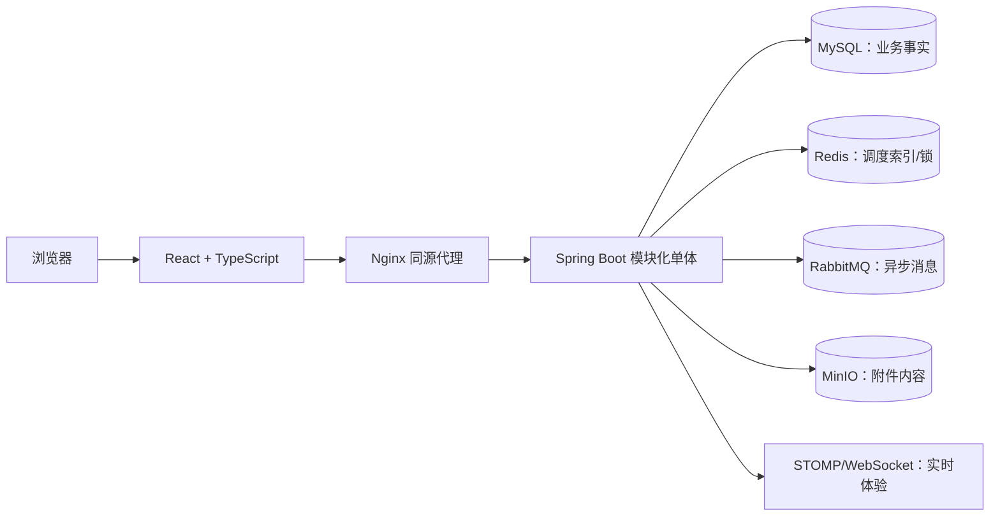
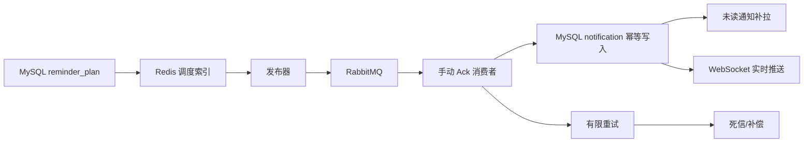

# 架构与核心设计

## 模块化单体

Controller 负责协议、验证和响应转换，Service 负责业务规则、事务和资源权限，Mapper/Repository 负责持久化。主要模块包括认证、组织、RBAC/数据范围、项目任务、评论、附件、提醒、通知和审计。

## 数据事实与外部系统

MySQL 保存任务、权限、提醒计划、通知、审计和附件元数据等事实；Redis 仅保存提醒 ZSet、活动会话和锁，索引丢失后可从 MySQL 重建；RabbitMQ 负责异步投递；MinIO 保存文件内容，MySQL 保存对象键、状态、大小、类型和校验信息。

## 任务状态与并发

任务状态包括 `DRAFT`、`PENDING_ACCEPTANCE`、`IN_PROGRESS`、`PENDING_REVIEW`、`REJECTED`、`COMPLETED`、`CANCELLED` 和 `ARCHIVED`。状态变化使用显式命令，不提供绕过状态机的任意 status 写入。

关键更新同时检查任务 ID、旧状态、调用方 version 和未删除状态，成功后递增 version；更新行数为 0 时返回冲突。任务操作日志与状态更新在事务内完成，避免重复提交或过期请求重复推进状态。

## 权限与数据范围

Controller 方法权限与 Service 资源校验双重执行。数据范围支持 `SELF`、`DEPARTMENT`、`DEPARTMENT_AND_CHILDREN`、`PROJECT` 和显式授予的 `ALL`。用户身份、项目成员、任务负责人、通知归属和附件关系均由后端推导和校验，前端隐藏按钮不是安全控制。

## 提醒与通知

通知使用稳定 message ID 与 user ID 做幂等边界，消费者有限重试，超过上限进入死信；WebSocket 推送失败不回滚核心事实写入。断线后以通知表和 HTTP 补拉恢复，而不是声称 WebSocket 是可靠消息队列。

## 迁移与部署权衡

Flyway 当前迁移为 V1–V8。Compose 验证 MySQL、Redis、RabbitMQ、MinIO、后端和前端六服务；Kind 只验证前后端应用层 Deployment、Service、ConfigMap、Secret、探针、滚动更新和 Pod 恢复，中间件仍由 Compose 提供。
