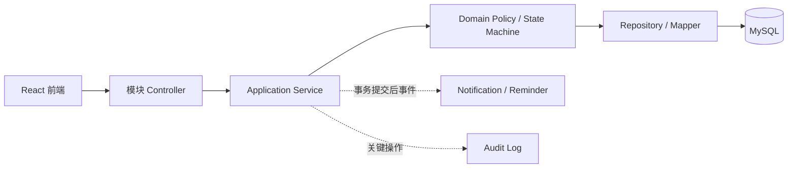

# 阶段 1 架构说明

## 模块边界

项目继续采用单体应用，按业务模块组织，而不是按全局 Controller/Service/Mapper 分层：

```text
common       统一错误、响应、校验、Trace ID、配置
auth         登录、Token、当前用户
organization 用户、部门、岗位
permission   角色、权限、数据范围
task         任务聚合、负责人、状态机、查询
attachment   MinIO 对象和附件元数据
comment      任务评论
notification 站内通知、提醒计划、WebSocket
audit        操作审计和审计查询
statistics   基于已授权查询的统计
```

每个模块按实际复杂度选择 `controller`、`application`、`domain`、`repository`、`dto`、`vo` 和 `entity`，不为简单模块机械创建空目录。

## 主要调用关系



Controller 只负责输入校验、身份上下文和响应转换。阶段 3 已将 JWT 身份上下文和基础功能权限校验落到后端；任务状态流转、完整数据范围和业务事务边界仍由后续应用服务及领域策略负责。

## 阶段 1 决策

- MySQL 是任务、权限和审计的持久化事实来源；
- Redis 只在提醒和权限缓存阶段作为加速层，不承担核心数据唯一存储；
- `task_operation_log` 保存任务状态前后值，`audit_log` 保存跨模块管理/访问审计，两者职责分离；
- `reminder_plan` 保存持久计划，`notification` 保存用户可查询的通知，不把二者合并成一张表。
