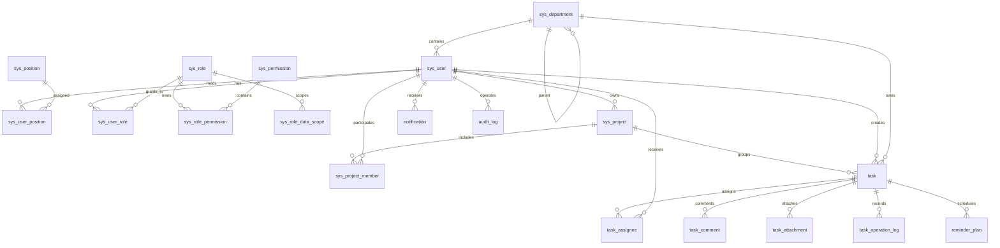

# 阶段 1 数据库设计

## 迁移边界

Flyway 迁移文件为 `src/main/resources/db/migration/V1__init_schema.sql`。它只负责空数据库建表、外键、检查约束和查询索引，不执行 `DROP TABLE`，也不写入默认账号。Flyway 自身会创建 `flyway_schema_history` 记录版本。

所有主键使用 `BIGINT`，核心业务表包含 `created_at`、`updated_at` 和必要的 `version`。日志表是追加型记录，不设置无意义的更新时间或乐观锁字段。

## ER 图

## 表职责

| 表 | 职责 | 关键约束/字段 |
| --- | --- | --- |
| `sys_user` | 用户和登录主体 | `username`、`employee_no` 唯一；`password_hash`；状态 |
| `sys_department` | 部门树 | `parent_id`、`path`、`level`；同一父部门下名称唯一 |
| `sys_position` | 岗位字典 | `position_code` 唯一 |
| `sys_user_position` | 用户-岗位关系 | `(user_id, position_id)` 唯一；主岗位标记 |
| `sys_role` | 角色 | `role_code` 唯一；内置角色标记 |
| `sys_permission` | 权限字典 | `permission_code` 稳定且唯一；资源+动作唯一 |
| `sys_user_role` | 用户-角色关系 | `(user_id, role_id)` 唯一 |
| `sys_role_permission` | 角色-权限关系 | `(role_id, permission_id)` 唯一 |
| `sys_role_data_scope` | 角色数据范围 | SELF、DEPARTMENT、DEPARTMENT_AND_CHILDREN、PROJECT、ALL |
| `sys_project` | 项目范围主体 | 项目编码唯一；负责人和归属部门 |
| `sys_project_member` | 项目经理/参与人关系 | `(project_id, user_id)` 唯一；区分 MANAGER 和 MEMBER |
| `task` | 任务聚合根 | `status`、`priority`、`due_at`、`version` |
| `task_assignee` | 主负责人/协作人 | `(task_id, user_id)` 唯一；类型检查 |
| `task_comment` | 任务评论和系统事件 | 按任务+时间查询 |
| `task_attachment` | 附件元数据 | bucket+object key 唯一；不存文件内容 |
| `task_operation_log` | 任务操作和状态变化 | 状态前后值、前后 JSON、操作者、Trace ID |
| `notification` | 用户最终可查询通知 | 用户+状态+时间联合查询 |
| `reminder_plan` | 持久化提醒计划 | 任务+类型+触发时间唯一；状态+触发时间扫描 |
| `audit_log` | 跨模块审计 | Trace、操作者、资源和结果 |

## 索引依据

| 索引 | 查询场景 | 不建立的索引 |
| --- | --- | --- |
| `idx_user_department_status` | 部门主管查询本部门有效用户 | 不给 display_name 单独建索引 |
| `idx_task_creator_status_created` | 用户查看自己创建的任务分页 | 不给 description 建索引 |
| `idx_task_project_status_due` | 项目任务按状态和截止时间筛选 | 不给每个筛选字段单独重复建索引 |
| `idx_task_department_status_due` | 部门范围任务和到期任务查询 | 与项目查询场景分开，避免依赖低选择性单列索引 |
| `idx_task_status_due` | 定时扫描即将到期/逾期任务 | 只服务调度扫描，不承担完整列表查询 |
| `idx_task_assignee_user_type` | 我的任务按负责人类型查询 | `(task_id,user_id)` 唯一约束已覆盖反向去重 |
| `idx_task_comment_task_created` | 任务详情评论时间线 | 不给评论内容建全文索引 |
| `idx_task_attachment_task_created` | 任务附件列表 | 对象 key 已有唯一约束 |
| `idx_task_operation_task_occurred` | 还原任务操作时间线 | 不给 JSON 前后数据建索引 |
| `idx_notification_user_status_created` | 未读通知分页和全部已读 | 不给 content 建索引 |
| `idx_reminder_status_trigger` | 定时任务领取到期提醒 | 与持久化计划状态直接对应 |
| `idx_audit_resource_occurred` | 按资源追踪审计记录 | `detail_json` 仅作为详情，不做无依据索引 |

唯一约束同时承担数据去重和查询辅助作用，避免为了“看起来完整”给每个字段建立索引。

## 删除和一致性

核心用户、角色、任务和日志不采用物理删除；通过状态、取消、归档或禁用保留审计链。外键默认限制删除，避免删除用户后任务历史失去操作者。附件删除只改变元数据状态，MinIO 对象清理在后续附件阶段设计补偿机制。

任务关键状态更新需要在同一事务中完成：读取当前版本 → 校验允许的状态转换 → `UPDATE ... WHERE id = ? AND version = ? AND status = ?` → 写入 `task_operation_log`。更新行数为 0 时返回并发冲突，事务回滚，不留下孤立日志。

## 验证范围

`DatabaseMigrationStructureTest` 已验证 V1/V2 文件包含全部核心表、关键唯一约束、状态检查、乐观锁和审计字段，并禁止 `DROP TABLE`。真实 MySQL 8.4 空库已完成一次完整迁移，Flyway 历史表显示 V1、V2 成功，schema version 为 2。
