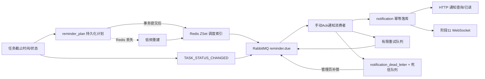

# 阶段 10 消息与提醒边界

阶段 9 负责提醒计划、Redis ZSet 和 RabbitMQ 发布；阶段 10 负责 RabbitMQ 消费、通知落库、幂等、有限重试和死信补偿；WebSocket 实时推送留给阶段 11。

- `reminder_plan` 是调度事实，`notification` 是用户最终可查询的事实；
- 发布消息的 `messageId` 固定为计划 ID 或任务版本键，下游按 `(source_message_id, user_id)` 幂等；
- RabbitMQ 使用 publisher confirm、mandatory returns、手动 Ack 和 TTL 重试队列；
- 单条消息最多处理 3 次，达到上限进入死信记录和死信队列，不进行无限重试；
- traceId 通过 message header 传递，并在死信记录中保留；
- WebSocket 使用 STOMP `CONNECT` 帧中的 Bearer Token 认证，服务端从认证 Principal 推导用户目的地；
- 通知写入事务提交后才进行 WebSocket 推送，推送失败不回滚通知或任务状态；
- WebSocket 只负责实时体验，断线后通过 HTTP 从 `notification` 补拉。
