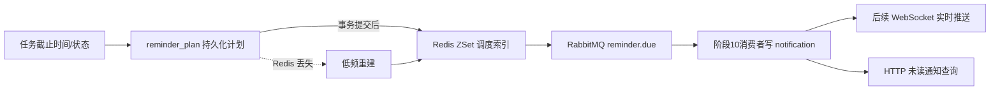

# 阶段 9 消息与提醒边界

阶段 9 已接入提醒计划、Redis ZSet 和 RabbitMQ 发布；RabbitMQ 消费者、通知生成和 WebSocket 仍留在阶段 10 以后。

- `reminder_plan` 是调度事实，记录任务、提醒类型、触发时间和状态；
- 定时任务先用 Redis 分布式锁，再只扫描 ZSet 中已到期的计划 ID；
- 任务事务提交后才更新 Redis，Redis 清空时由 `reminder_plan` 低频重建；
- 发布消息的 `messageId` 固定为 `reminder_plan.id`，下游必须按此幂等；
- `notification` 是用户最终可查询的事实，记录未读/已读；
- WebSocket 只负责实时体验，断线后通过 HTTP 从 `notification` 补拉；
- 当前阶段不实现 RabbitMQ 消费者和通知落库。
