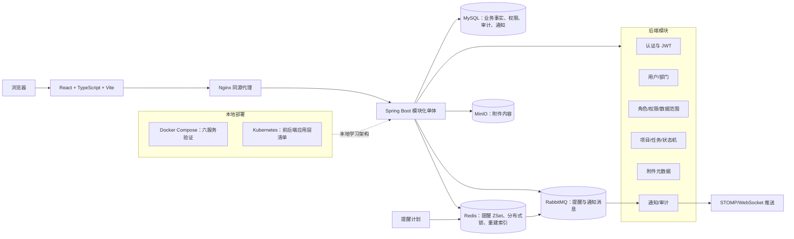
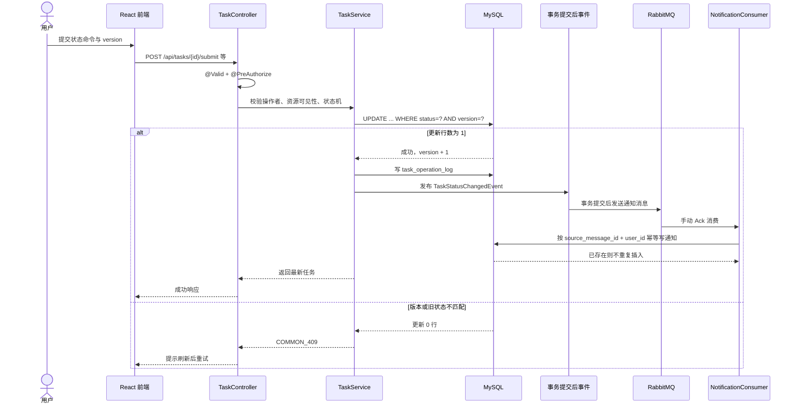
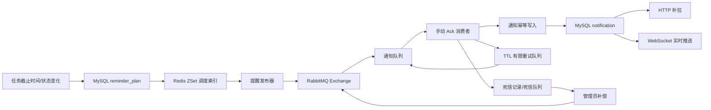

# 阶段 19：面试和简历材料（中文版本）

本文只使用当前仓库中已经实现并验证的内容。除非明确标注为“配置目标”或“未验证”，不要把本地 Compose、Kubernetes 清单、测试数据或示例配置描述成生产运行结果。

## 一、5 条中文简历描述

1. 使用 Java 17、Spring Boot、Spring Security、MyBatis-Plus 和 MySQL 构建模块化单体任务协同平台，覆盖认证、项目、任务、评论、附件、通知和组织权限模块。
2. 实现任务状态机与基于 `status + version` 的乐观并发控制，拒绝非法状态流转、重复提交和过期版本更新，并在事务内记录任务操作日志。
3. 设计 Redis ZSet + RabbitMQ 的提醒与通知链路，加入事务提交后事件、消息幂等、手动 Ack、有限重试、死信记录和 WebSocket 实时推送。
4. 集成 MinIO 保存附件内容、MySQL 保存元数据，完成任务级数据权限、文件大小/类型/内容签名校验和上传失败补偿。
5. 补充后端自动化测试、前端构建、六服务 Docker Compose 部署和本地 Kubernetes 应用层清单；阶段18完成了审计地址和附件内容校验安全加固。

## 二、6 条中文详细简历描述

1. 负责任务协同核心链路的模块化实现，将 Controller、Service、Mapper、状态策略和权限校验分离，避免 Controller 承担业务决策；任务支持草稿维护、项目关联、负责人/协作者、查询分页、评论和附件。
2. 针对任务并发操作使用数据库条件更新：同时校验任务当前状态、调用方携带的版本号和未删除状态，更新成功后才写入操作日志和发布状态事件；重复或过期请求统一返回冲突错误。
3. 将提醒计划、通知事实和实时推送拆分：`reminder_plan` 保存持久计划，Redis 仅作为调度索引，RabbitMQ 负责异步投递，`notification` 负责用户查询；Redis 索引丢失时通过数据库重建。
4. 为 RabbitMQ 消费者设计按消息 ID 的幂等处理、有限重试和死信补偿，使用 publisher confirm、mandatory returns、手动 Ack 和 traceId/messageId 传递，避免无限重试和重复通知。
5. 使用 Spring Security 方法级权限和服务层数据范围双重保护资源访问；数据范围支持 SELF、DEPARTMENT、DEPARTMENT_AND_CHILDREN、PROJECT、ALL，并由后端根据当前用户身份推导过滤条件。
6. 完成 Docker Compose 六服务运行验证以及后端/前端构建验证；当前默认 Maven 测试结果为 58 项通过、1 项可选容器测试跳过，未虚构接口性能、生产并发或 Kubernetes 实际恢复指标。

## 三、30 秒项目介绍

这是一个面向企业任务协同和流程管理的模块化单体平台，后端使用 Java 17、Spring Boot、Spring Security、MyBatis-Plus 和 MySQL，前端使用 React、TypeScript 和 Vite。核心难点是任务状态流转、并发更新、数据权限以及提醒通知的一致性。我用数据库保存任务和权限事实，用 Redis 做提醒索引，用 RabbitMQ 做异步通知，再通过 WebSocket 提升实时体验，同时补充了附件补偿、幂等消费、自动化测试和本地容器部署。

## 四、2 分钟项目介绍

项目目标是提供一套企业内部任务协同平台，用户可以登录后参与项目、创建和维护任务、转交负责人、执行状态流转、发表评论、上传附件并查看通知。

架构上采用模块化单体，而不是为了展示技术拆成多个微服务。认证模块使用 BCrypt 校验密码、JWT 传递身份，并在每次请求重新加载当前用户，用户被禁用后不会一直信任旧权限。权限上使用 RBAC，再叠加数据范围过滤，Controller 先做功能权限校验，Service 再检查资源归属、项目成员和当前用户的数据范围。

任务模块的关键设计是状态机和乐观锁。请求必须携带版本号，数据库更新同时检查旧状态和版本，更新成功后才写操作日志；这样同一版本的重复请求会变成冲突，不会重复推进状态。任务状态变更通过事务提交后事件进入提醒和通知链路。

提醒模块把 MySQL 中的 `reminder_plan` 作为事实来源，Redis ZSet 负责调度索引，定时扫描后向 RabbitMQ 发布消息。消费者按消息 ID 和用户 ID 幂等写入通知，失败时最多进行有限次数重试，超过上限记录死信并支持管理员补偿。WebSocket 只负责实时推送，断线后仍通过 HTTP 从通知表补拉。

质量方面，项目有后端单元/接口测试、前端构建、Docker Compose 六服务健康验证和 Kubernetes 应用层清单。当前能如实报告的是测试与本地容器结果；生产级高可用、登录限流、TLS、集中式密钥管理和真实 Kubernetes 集群恢复仍是后续工作。

## 五、实习场景下的个人职责说明

可以采用下面这种真实边界表达：

> 我主要负责任务协同平台中后端模块的设计和实现，重点参与认证权限、项目/任务流程、并发控制、提醒通知、附件元数据和测试部署工作。我能够说明自己实际阅读、修改和验证过的代码；数据库迁移、前端页面、Docker Compose 和 Kubernetes 清单属于项目整体成果，面试时会按实际分工说明哪些是我直接实现、哪些是团队协作或已有基础。

如果确实是个人练习项目，可以说“我在本地完成了这些模块的实现与验证”；如果是团队项目，应改用“参与设计”“负责其中的某模块”“与团队协作完成”，不要把整个仓库的所有成果都表述为个人独立完成。

## 六、“参与研发”和“独立实现”的边界

| 表述 | 适用条件 |
| --- | --- |
| “我独立实现了任务状态机和版本条件更新” | 只有在确实由本人完成并能解释 `TaskStateMachine`、`TaskMapper.updateStatusWithVersion` 和测试时使用 |
| “我负责提醒通知链路中的消费者幂等和有限重试” | 能明确指出消费者、通知表唯一约束、重试队列和死信服务的代码边界 |
| “我参与了前端和容器化工作” | 只验证过整体构建或修改过部分文件，无法证明全量设计时使用 |
| “项目实现了生产级 Kubernetes 高可用” | 当前不能使用；阶段17只验证了清单渲染，未完成真实集群认证和 Pod 自动恢复验证 |
| “系统支持某个 QPS/用户量” | 当前不能使用；没有真实基准数据 |
| “团队完成了六服务 Compose 部署” | 团队成果或整体成果的安全表达，不暗示个人独立完成全部内容 |

## 七、项目架构图



说明：MySQL 是核心业务事实来源，Redis 不是核心业务唯一数据源；阶段17的 Kubernetes 只部署前端和后端，中间件仍由 Docker Compose 提供，不能描述成生产高可用架构。

## 八、任务状态时序图



## 九、RBAC 和数据权限说明

```mermaid
flowchart TD
    USER[用户] --> UR[用户角色]
    UR --> ROLE[角色]
    ROLE --> PERM[功能权限编码]
    ROLE --> SCOPE[数据范围]
    REQUEST[请求] --> METHOD[@PreAuthorize 方法权限]
    METHOD --> SERVICE[服务层资源校验]
    SERVICE --> FILTER[当前用户数据范围过滤]
    FILTER --> RESULT[只返回可见资源]
```

功能权限回答“能否执行某类动作”，数据范围回答“能作用于哪些数据”。当前代码中的数据范围包括：

- `SELF`：本人创建、负责或参与的记录；
- `DEPARTMENT`：当前部门记录；
- `DEPARTMENT_AND_CHILDREN`：当前部门及子部门；
- `PROJECT`：用户负责或参与的项目及其任务；
- `ALL`：显式授予的全量范围。

后端权限不是只依赖前端按钮：Controller 使用 `@PreAuthorize`，Service 还会验证任务/项目可见性、负责人是否为有效用户或项目成员、附件是否属于目标任务、通知是否属于当前用户。越权测试和数据范围测试已纳入后端测试范围。

## 十、提醒消息链路说明



Redis 只承担调度索引；索引丢失后由数据库计划重建。消息使用稳定 `messageId`，通知写入按消息和用户幂等。RabbitMQ 消费失败最多处理 3 次，超过上限进入死信，不进行无限重试。WebSocket 推送在事务提交后执行，推送失败不回滚核心业务写入。

## 十一、50 个项目深挖问题与参考回答

### 架构与技术选型

1. **为什么选择模块化单体而不是微服务？**  当前业务边界仍在演进，模块化单体可以保持认证、任务、权限和事务调用简单，同时按模块隔离职责；没有为展示技术而引入服务间网络调用。
2. **模块边界如何划分？**  按认证、组织、权限、项目任务、评论、附件、提醒通知和审计划分；Controller 负责协议，Service 负责业务，Mapper/Repository 负责持久化。
3. **MySQL 在架构中的角色是什么？**  它保存任务、权限、通知、提醒计划、审计和附件元数据等事实；Redis 只做调度索引和锁，不能作为核心业务唯一数据源。
4. **为什么同时使用 MyBatis-Plus 和 JdbcTemplate？**  常规实体 CRUD 使用 MyBatis-Plus，条件更新、批量关系操作和需要明确 SQL 的场景使用参数化 JdbcTemplate；两者都不拼接用户输入。
5. **为什么需要 Flyway？**  数据库结构和权限种子必须可追踪、可重复应用，当前迁移版本为 V1 到 V8；应用启动时由 Flyway 校验和执行迁移。
6. **前端为什么使用 Nginx 代理？**  生产构建后的静态资源由 Nginx 提供，同时将 `/api`、`/actuator` 和 `/ws` 代理到后端，减少浏览器跨域配置复杂度。
7. **为什么 Redis 不是提醒的事实来源？**  Redis 可能丢失或重启，提醒计划必须在 MySQL 中持久化；Redis ZSet 只保存下一次调度索引，丢失后可以重建。
8. **为什么阶段17没有把所有中间件都部署到 Kubernetes？**  本阶段目标是学习应用层 Deployment、Service、ConfigMap、Secret 和探针；中间件高可用不属于本阶段，当前明确仍由 Compose 单实例提供。
9. **为什么没有宣称 Kubernetes 提升接口性能？**  部署形态和接口性能不是同一个指标；当前没有完成真实集群基准测试，因此只报告清单和静态渲染结果。
10. **Controller 为什么不能写核心业务逻辑？**  Controller 应只做输入校验、身份上下文和响应转换，业务规则集中在 Service/状态策略，便于事务、测试和权限复用。

### 认证、权限与安全

11. **登录密码如何保存？**  使用 Spring Security 的 BCryptPasswordEncoder 保存密码哈希，不在 Flyway 中写入明文密码。
12. **JWT 中保存了什么？**  保存 subject、用户 ID、签发时间和过期时间；每次请求还会按 subject 查询当前用户和权限，避免只依赖 Token 内的旧权限。
13. **禁用用户后旧 Token 还能用吗？**  正常请求会重新加载当前用户，禁用或锁定状态会阻止认证；但当前没有 Token 黑名单，正常退出不能立即撤销已经签发的 Token。
14. **为什么使用方法级 `@PreAuthorize`？**  它把功能权限放在具体操作入口，能够区分读、写、状态操作和死信补偿；Service 仍需再次做资源和数据范围校验。
15. **前端隐藏按钮能否算权限控制？**  不能。前端隐藏只是体验优化，真正的权限由后端 Security 和 Service 执行。
16. **如何避免用户通过传入其他 userId 越权？**  当前用户身份从认证 Principal 获取，任务负责人、项目成员、通知归属和附件任务关系都在服务层重新查询校验。
17. **数据范围有哪些类型？**  SELF、DEPARTMENT、DEPARTMENT_AND_CHILDREN、PROJECT 和 ALL；服务根据当前用户角色和部门计算可见 ID，再加入查询条件。
18. **有什么 SQL 注入风险？**  当前审查没有发现用户输入直接进入 SQL；MyBatis 使用 `#{}`，JdbcTemplate 使用 `?`，动态 IN 只动态生成占位符数量，值仍参数绑定。
19. **为什么登录接口还存在安全遗留？**  当前没有 Redis 登录失败限流、账号锁定或验证码，公开部署时需要补充，否则会有密码猜测风险。
20. **Token 放在 localStorage 有什么问题？**  XSS 一旦发生，脚本可能读取 Token；后续应评估 HttpOnly Cookie、CSP 和更严格的前端输入输出策略。

### 任务、状态机与并发

21. **任务状态有哪些？**  DRAFT、PENDING_ACCEPTANCE、IN_PROGRESS、PENDING_REVIEW、REJECTED、COMPLETED、CANCELLED 和 ARCHIVED。
22. **为什么不提供通用修改 status 接口？**  通用修改会绕过状态机和操作者规则；当前为每个命令提供独立入口，由状态机决定合法目标状态。
23. **乐观锁具体怎么做？**  更新时同时检查任务 ID、旧状态、调用方 version 和 deleted=0，成功后 version 加一；更新行数为 0 就返回冲突。
24. **重复提交如何处理？**  第一次请求成功后版本递增，第二次仍带旧版本，条件更新失败并返回 COMMON_409，不会重复写状态日志。
25. **转交为什么也要消耗版本？**  转交虽然不改变状态，但改变了负责人关系，也需要避免两个并发转交互相覆盖，因此使用状态不变的条件更新消耗版本。
26. **状态和操作日志如何保证一致？**  状态更新、操作日志、负责人变更和提醒计划变化放在同一事务内；日志写入失败会回滚状态更新。
27. **谁可以执行任务命令？**  先通过 Controller 功能权限，再由 Service 按数据范围、创建人、项目经理、主负责人和命令类型判断。
28. **为什么 `approve` 和 `complete` 是两个接口？**  它们是兼容入口，但都表示完成动作；状态机实际使用同一完成转移规则。
29. **任务查询如何避免一次加载大量关联数据？**  先分页查询任务，再批量按任务 ID 查询负责人，避免对每条任务单独查询造成明显 N+1 结构。
30. **任务删除是真删除吗？**  草稿删除使用逻辑删除和版本控制，不直接物理删除业务记录，便于保留审计和关联一致性。

### 消息、提醒与附件

31. **提醒计划和通知表为什么分开？**  提醒计划描述“什么时候触发”，通知表描述“用户最终看到了什么”；两者生命周期和查询需求不同。
32. **Redis ZSet 丢数据怎么办？**  定时重建任务从 MySQL 中读取仍处于计划状态的提醒，重新写入 Redis 索引。
33. **如何避免提醒重复发布？**  分布式 Redis 锁限制扫描者，计划使用版本和状态条件更新；消费者再通过消息 ID 做通知幂等。
34. **RabbitMQ 消费者为什么手动 Ack？**  只有通知落库成功或失败处理已完成后才确认消息，避免自动 Ack 导致消息丢失。
35. **重试为什么不能无限进行？**  下游永久失败时无限重试会造成消息堆积和资源耗尽；当前最多 3 次，超过后记录死信并允许管理员补偿。
36. **消息幂等键是什么？**  通知插入使用 source_message_id 与 user_id 的业务唯一关系；同一来源消息对同一用户重复消费不会重复插入。
37. **为什么使用事务提交后事件？**  如果数据库事务尚未提交就发送消息，消费者可能读不到任务最新状态；提交后发送可以降低这个窗口，核心写入也不会被推送失败回滚。
38. **WebSocket 断线后通知会丢吗？**  WebSocket 只负责实时体验，通知已经持久化在 notification 表，客户端重新连接后通过 HTTP 补拉未读通知。
39. **附件内容放在哪里？**  文件内容放 MinIO，MySQL 只保存任务关系、原文件名、类型、大小、校验值、对象键和状态等元数据。
40. **附件上传失败如何补偿？**  先写入上传中元数据，MinIO 成功后标记可用；对象写入或元数据更新失败时尝试删除对象并把元数据置为失败/待清理状态。

### 测试、部署与项目真实性

41. **当前测试结果是什么？**  默认 Maven 测试为 58 项通过、1 项可选 Testcontainers 测试跳过；前端 `npm run build` 通过，Compose 配置和后端运行时健康检查也通过。
42. **为什么有一个测试跳过？**  它依赖可选的容器集成环境；默认测试保持 Docker 独立，集成测试需要显式打开对应参数。
43. **Compose 部署包含哪些服务？**  MySQL、Redis、RabbitMQ、MinIO、Spring Boot 后端和 Nginx 前端，共六个服务；当前本地验证均为 healthy。
44. **Kubernetes 阶段验证到什么程度？**  已完成 Namespace、ConfigMap、Secret、Deployment、Service、探针和资源配置的 Kustomize 渲染；当前 context 未认证，未宣称真实 Pod 部署和自动恢复验证。
45. **如何验证 Pod 自动恢复？**  在已认证的本地集群中删除后端 Pod，观察 Deployment 重新创建 Pod、readiness 通过后才加入 Service Endpoints，再执行 rollout status。
46. **项目有没有真实 QPS 或延迟指标？**  没有可直接写入简历的固定指标；项目提供压测和运行时采集工具，但真实数字必须在指定机器和数据规模下重新测量。
47. **依赖分析有没有问题？**  Maven dependency:analyze 成功，但由于 Spring Boot 传递依赖和测试依赖报告了静态分析警告；没有仅凭警告删除运行时依赖。
48. **阶段18修复了什么？**  审计地址不再直接信任 X-Forwarded-For，附件增加内容签名校验，并移除文档中的可复制管理员密码。
49. **项目哪些部分不能说成生产能力？**  默认开发凭据、单实例中间件、未完成 TLS/登录限流/集中密钥管理、未验证的 Kubernetes 自动恢复和未执行的在线漏洞扫描都不能说成生产能力。
50. **如何证明不是夸大个人贡献？**  按模块和提交证据说明“我实现/我参与/团队完成”的边界，能够指向具体类、测试和验证命令；无法证明的架构、指标和生产结果明确标注未验证。

## 十二、项目中最困难的 5 个问题

1. **状态机与并发更新同时成立。**  不能只判断当前状态，还要让数据库条件更新同时校验旧状态和版本，避免并发请求覆盖彼此结果。
2. **提醒计划、Redis 索引和 RabbitMQ 消息的一致性。**  需要区分持久事实、临时索引和异步消息，并设计锁、版本更新、有限重试和重建机制。
3. **通知的重复消费和实时推送。**  消费者要做到幂等，WebSocket 推送又不能成为事务依赖，因此采用持久通知表 + 提交后推送 + HTTP 补拉。
4. **RBAC 与数据范围叠加。**  “有任务读取权限”不等于“能读取任意任务”，需要将功能权限、当前用户身份、项目成员关系和部门范围一起校验。
5. **附件的跨系统补偿。**  MySQL 和 MinIO 没有同一个本地事务，必须维护上传中/可用/失败状态，并在对象操作失败时尝试补偿和记录异常。

## 十三、可以如实量化的指标

以下是当前仓库和验证记录能够支持的量化事实，不是性能指标：

- Java 17；Spring Boot 3.4.8；
- Flyway 迁移 V1–V8；
- 默认 Maven 测试 58 项通过、1 项可选集成测试跳过；
- Docker Compose 本地验证 6 个服务健康；
- 后端 Kubernetes Deployment 清单目标副本数为 2，但未完成真实集群运行验证；
- RabbitMQ 消费失败最多 3 次后进入死信；
- 附件默认最大 10MB；
- Controller 分页参数默认 20、上限通常为 100；
- JWT 默认过期配置为 120 分钟；
- 后端健康接口运行时验证返回 HTTP 200。

不要把以上配置值写成吞吐量、稳定在线用户数、P95 延迟或可用性指标。

## 十四、不能写入简历的未完成内容

- 生产级 MySQL、Redis、RabbitMQ、MinIO 高可用；
- 已认证 Kubernetes 集群中的 Pod 自动恢复实测结果；
- 任何未经压测工具实际测量的 QPS、延迟、用户量和成功率；
- 登录限流、验证码、Token 黑名单和完整账号风控；
- TLS/WSS、集中式 Secret Manager 和生产密钥轮换；
- 附件病毒扫描、内容安全审核和压缩炸弹防护；
- 在线漏洞数据库扫描已经完成；
- 由本人独立完成整个团队项目或全部前端、后端、部署工作。

## 十五、面试官可能怀疑的表述与修正

| 容易被追问的表述 | 更准确的说法 |
| --- | --- |
| “实现了 Kubernetes 高可用” | “编写了应用层 Kubernetes 清单，配置了双副本和滚动更新；真实集群恢复尚未验证” |
| “系统支持高并发” | “实现了乐观锁、批量关联查询和有限消息重试；性能数字需要基准测试” |
| “保证消息绝不丢失” | “使用 publisher confirm、手动 Ack、幂等和死信降低丢失/重复风险，仍需结合部署和故障演练验证” |
| “系统安全可靠” | “已覆盖 RBAC、数据范围、JWT、上传校验和幂等测试，同时明确登录限流、TLS、密钥管理等遗留项” |
| “我独立完成全部项目” | “我负责并能深入解释 X 模块，其他部分按团队分工说明” |
| “做了性能优化并提升了 30%” | “提供了数据准备、压测和 EXPLAIN 工具，当前没有填写未经实测的提升比例” |

## 十六、如何避免把团队成果错误描述为个人独立成果

1. 先列出自己的实际模块、文件、测试和验证命令，再描述贡献。
2. 使用“负责”“参与”“协作完成”“在已有基础上修改”等动词区分贡献程度。
3. 面试中主动说明项目整体架构与个人负责边界，尤其是前端、部署和数据库迁移部分。
4. 对无法从提交记录、任务记录或代码理解中证明的性能和生产结果，明确说“未验证”。
5. 被追问其他模块时，不假装熟悉；可以说明整体链路，再准确指出自己没有独立负责的部分。
6. 简历中只保留能回答“为什么这样设计、失败时怎么办、如何验证”的内容。

## 十七、推荐面试准备顺序

先熟悉任务状态机和乐观锁，再熟悉提醒/通知链路，之后复习 RBAC/数据范围和附件补偿。最后准备 Docker Compose、Kubernetes 清单与阶段18遗留风险。这样回答可以从一个完整业务流程展开，而不是只罗列技术名词。
