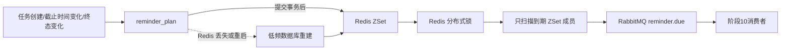

# 阶段 9：提醒计划

## 边界

阶段 9 使用 V1 已存在的 `reminder_plan` 表，不新增数据库表或索引。数据库保存提醒计划事实，Redis ZSet 只保存近期待触发索引，RabbitMQ 负责承接到期提醒消息；阶段 10 再实现消息消费者和站内通知落库。

提醒类型：

- `DUE_SOON`：截止时间前的提醒，默认提前 24 小时；
- `OVERDUE`：截止时间到达后的逾期提醒。

创建任务时如果有截止时间生成计划；草稿修改截止时间时取消旧的 `PLANNED` 计划并生成新计划；任务完成、取消、归档或删除草稿时取消未触发计划。

## 数据库与索引

`reminder_plan` 的 `task_id + reminder_type + trigger_at` 唯一约束防止同一计划重复创建，`status + trigger_at` 联合索引支持持久化扫描和恢复。阶段9没有为 Redis 查询重复建立数据库索引，也没有把 Redis 当作唯一数据源。

状态使用现有枚举：`PLANNED`、`EMITTED`、`CANCELLED`、`FAILED`。投递成功后用 `id + status + version` 条件更新为 `EMITTED`；消息投递失败标记 `FAILED`，不进行无限自动重试。

## 调度流程



任务事务只负责更新 MySQL，Redis 索引通过 `AFTER_COMMIT` 事件更新，避免在核心数据库事务中执行不必要的网络调用。定时扫描只访问 Redis ZSet；低频重建任务才读取数据库中的 `PLANNED` 计划。

扫描过程：获取带 TTL 的 Redis 锁，原子移除一批到期计划 ID，校验数据库计划仍为 `PLANNED` 后发布 RabbitMQ 消息，最后用版本条件更新为 `EMITTED`。锁过期、进程崩溃或数据库更新失败时，消息可能按至少一次语义再次出现；消息 ID 固定为 `planId`，阶段10消费者必须以此实现幂等。

## 配置

阶段9默认关闭，避免没有 Redis/RabbitMQ 时影响基础测试。启用本地提醒：

```properties
REMINDER_ENABLED=true
REDIS_URL=redis://localhost:6380
RABBITMQ_HOST=localhost
RABBITMQ_PORT=5673
RABBITMQ_USERNAME=taskflow
RABBITMQ_PASSWORD=taskflow_local
```

完整示例见 `application-local.yml.example`。交换机、队列和 routing key 由 `taskflow.reminder.rabbit.*` 配置控制。

## 恢复与风险

- Redis 清空后，低频重建任务从数据库重新写入全部 `PLANNED` 计划；
- 截止时间修改会让旧计划变为 `CANCELLED`，旧 Redis 成员由任务重建事件移除；
- 终态任务不再产生或发送未触发提醒；
- RabbitMQ 发布成功但应用在数据库状态更新前崩溃时可能重复投递，消息 ID 和下游幂等是必要防线；
- 当前阶段没有消费者、通知生成和失败重试队列，这些属于阶段10。
