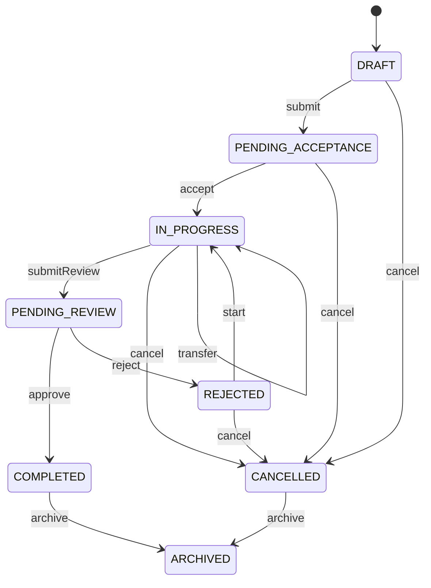

# 任务状态机

## 状态

`DRAFT`、`PENDING_ACCEPTANCE`、`IN_PROGRESS`、`PENDING_REVIEW`、`REJECTED`、`COMPLETED`、`CANCELLED`、`ARCHIVED`。

## 状态图



`transfer` 不改变状态，只变更 `task_assignee` 并写操作日志。`accept` 表示接受待办并进入处理，`start` 专门表示驳回后的重新处理，避免两个命令对同一状态产生含义冲突。

阶段 7 已将上述命令接入 `/api/tasks/{id}/...` 独立接口，不提供任意修改 `status` 的通用接口。`approve` 和 `complete` 是同一完成动作的两个兼容入口。状态更新必须校验操作者、当前状态和 `version`；并发冲突时返回 `COMMON_409`，状态和操作日志在同一事务中提交。

重复提交的策略是显式冲突：同一版本同一命令第一次成功后版本已递增，再次提交会因 `status + version` 条件不满足返回 `COMMON_409`，不会重复写状态日志。完成、归档等终态不得重复产生新的状态日志。

## 并发更新约束

状态命令由 `TaskMapper.updateStatusWithVersion` 执行条件更新：

```sql
UPDATE task
SET status = :toStatus, version = version + 1,
    updated_by = :operatorId, updated_at = CURRENT_TIMESTAMP(3)
WHERE id = :taskId
  AND status = :fromStatus
  AND version = :version
  AND deleted = 0;
```

返回行数为 `0` 时统一转换为 `COMMON_409`。由于命令方法使用事务，只有任务更新成功后才会写入 `task_operation_log`；日志写入失败会回滚任务更新。转交使用相同的条件更新，只是目标状态等于旧状态，然后在同一事务中重建负责人关系并写转交日志。

阶段 7 测试覆盖：状态命令使用旧状态和版本、并发/重复请求不写孤儿日志、非法和终态命令被拒绝，以及 Mapper 注解中的条件更新契约。
